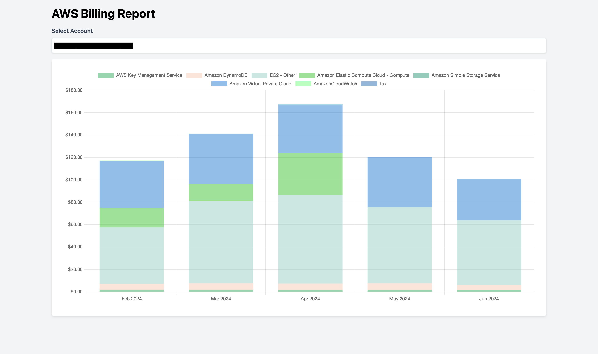

# aws-cost-analyzer

An easier way to break down AWS costs by account.

## Setup

Create a .env file from the example.  You will need an AWS Access Key and Secret Access Key along with your organization account ID.

https://docs.aws.amazon.com/IAM/latest/UserGuide/id_credentials_access-keys.html

NOTE: FLASK_HOST is not currently binding correctly.
```
FLASK_HOST=0.0.0.0
FLASK_PORT=5000
FLASK_DEBUG=False
AWS_ACCESS_KEY_ID=your-access-key
AWS_SECRET_ACCESS_KEY=your-secret-key
AWS_ORG_ID=123456789000
```

## Usage

### Docker (recommended)
Local Image
```bash
$ docker build -t local/aws-cost-analyzer:dev .
$ docker run --env-file=.env -p 5000:5000 local/aws-cost-analyzer:dev
```
Docker Hub Image
```bash
$ docker run --env-file=.env -p 5000:5000 heysarver/aws-cost-analyzer:dev
```

The app will be available at http://localhost:5000/

Directly access an account by http://localhost:5000/?account_id=123 or http://localhost:5000/?account_id=all

### Python venv

Python 3.10

```bash
$ python -m venv venv && source venv/bin/activate
$ python app.py
```
Use the link in the output to access the app.

## Screenshot


